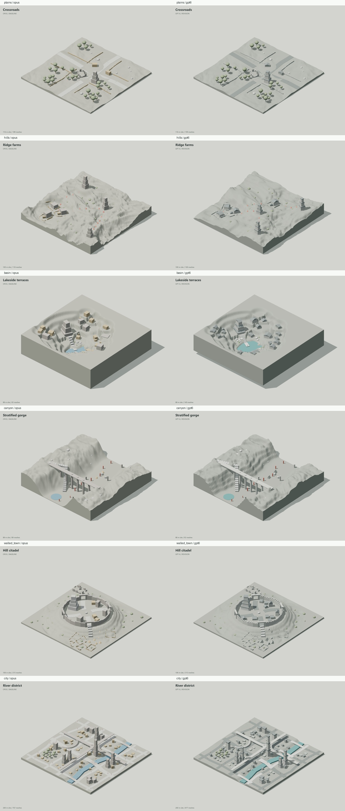

# Terrain Whitebox Comparison

Six procedural GLB scenes, compared with the user-provided Opus baseline at
`efba5ea5be180767368180dc411a664efcb74076`. The GPT-6 revision retains the
landform/foreground API and develops the massing and silhouettes of that baseline.

| Scene | Revision |
| --- | --- |
| Plains | Legible dark roads, roofed outbuildings, articulated watchtower, faceted vegetation |
| Hills | Broader rolling ridges, buildable farm pads, roofed farmsteads and tiered beacons |
| Basin | Shallower terraces, a larger lake, pitched hall roofs, shorter stair risers |
| Canyon | Five geological benches, faceted talus, pitched camp tents and the existing rim crossing |
| Walled town | Crenellated curtain wall, street-aligned houses, pitched roofs and triangular tents |
| City | Street-aligned frontage, taller core skyline, flat roof bands, clear road and river hierarchy |



## Geometry Contract

`terrain_code_edit.building` articulates an already fitted box into a foundation,
main volume and roof. The complete assembly stays within the original envelope,
including at arbitrary yaw on sloping ground. Roofs use the existing GLB writer's
convex `extrude` primitive. `battlement` similarly cuts gaps into a wall envelope.
All generated geometry is ordinary GLB mesh geometry, with no viewer-only props.

The original building id identifies the main volume. Foundation and roof ids are
prefixed with `plinth-` and `roof-`; a detail-stage replacement of the main volume
does not automatically replace those companion parts. Scene-level `seed` now
controls both stages. `foreground_args={"seed": ...}` still overrides population
independently. Foreground grading is baked before placement. Basin shoreline
coverage is remeasured after grading, including cylinder polygon clearance.

These are blockouts, not a navmesh or an engine playtest. The geometry checks cover
ids, dimensions, overlaps and terrain boundaries; route assertions check the
authored paths and connections. They do not establish gameplay reachability for
an arbitrary character controller.

## Reproduce

Generation and unit tests use only Python's standard library. Run from the repository root:

```powershell
conda activate aibasis
python test/test_3d_scene_code.py
python scripts/terrain_whitebox_demo.py
```

To compare against the Opus version, use a separate checkout of `efba5ea`:

```powershell
git worktree add ../terrain-opus efba5ea
python scripts/terrain_whitebox_demo.py --source ../terrain-opus --variant opus
```

The visual demo requires Playwright, Pillow, ffmpeg on PATH, and a browser.
Windows uses installed Microsoft Edge; other platforms use Playwright Chromium.
Dependencies are optional and do not affect scene generation:

```powershell
python -m pip install playwright Pillow
# On Linux/macOS: python -m playwright install chromium
python scripts/render_terrain_whitebox.py --frames 120
python -m http.server 8766 --bind 127.0.0.1 --directory test_data/outputs/terrain_whitebox
```

Open `http://127.0.0.1:8766`. The viewer supports synchronized orbit/pan/zoom,
version and scene selection, wireframe, white clay, reset, rotation and GLB download.
The first render downloads pinned Three.js 0.170.0 modules; later renders work
offline. `--frames 0` renders screenshots without ffmpeg. The legacy
`python test/test_3d_scene_code.py --video` entry point now exports and records
all six revised scenes using the same cross-platform renderer.

The comparison uses identical lights and camera framing derived from the union of
both GLBs, including separate-version captures. Videos are 1280 x 960, 24 fps,
120 frames (five seconds). The renderer checks canvas variation and camera motion,
captures desktop/mobile layouts and writes `render_report.json`. Each export has
a manifest with the git revision, source hash, geometry checks and file sizes.

## Deliverables

The demo bundle contains both versions' six GLBs, twelve PNGs, twelve MP4s,
the comparison sheet, offline viewer dependencies and validation manifests.
Code and review artifacts are kept in DongYu2005's fork. `ISSUE_56.md` is prepared
for the upstream demo thread; it is not posted automatically.
